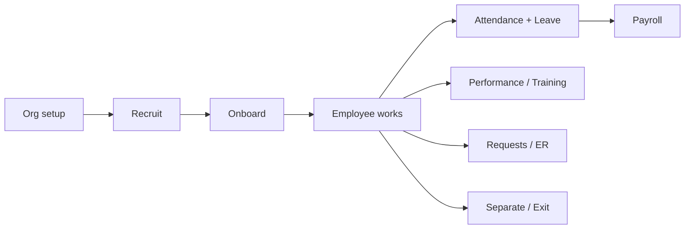

# How QD HRMS Works (plain language)

## What you are building

You are **not** rebuilding ERPNext.

You are building a **custom HRMS layer** (`qd_hrms`) on top of ERPNext + Frappe HR for **Quick Delivery Service**.

```
┌─────────────────────────────────────────────┐
│  Users (Employee, Manager, HR, Payroll…)    │
└────────────────────┬────────────────────────┘
                     │ browser
┌────────────────────▼────────────────────────┐
│  Desk UI: QD Workspaces (what you design)   │
│  HR / Manager / Employee dashboards         │
│  (+ Administrator = full site control)      │
└────────────────────┬────────────────────────┘
                     │ uses
┌────────────────────▼────────────────────────┐
│  qd_hrms (YOUR app)                         │
│  - QD Position, later Requests, ER, etc.    │
│  - custom fields, workflows, dashboards     │
└────────────────────┬────────────────────────┘
                     │ extends
┌────────────────────▼────────────────────────┐
│  Frappe HR (hrms) + ERPNext                 │
│  Employee, Leave, Attendance, Payroll…     │
│  Company, Branch, Department…               │
└─────────────────────────────────────────────┘
```

**Core rule:** ERPNext = engine. `qd_hrms` = Quick Delivery’s steering wheel and dashboard.

---

## Why you still see Manufacturing, Stock, Website…

ERPNext installs **many modules by default**. They are installed software, but:

- You do **not** have to use them
- Staff should **not** see them in the sidebar
- Hiding ≠ deleting (safe for upgrades)

What you see now is the **Administrator** view: System Manager sees almost everything. That is why Accounting, Buying, Selling, Stock, Manufacturing appear next to your QD workspaces.

For real users (HR Officer, Rider, Manager), `qd_hrms` assigns a **Module Profile** (same name as Role Profile) that blocks commerce modules. Pick **Role Profile** on User create — Module Profile + default dashboard workspace are applied automatically.

---

## How the existing modules map to your sitemap

| Your need | Use this (already exists) | Don’t rebuild |
|---|---|---|
| Company, Branch, Dept | Company, Branch, Department | — |
| Job titles / grades | Designation, Employee Grade | — |
| Headcount seats | **QD Position** (custom) | — |
| People | Employee | — |
| Attendance / biometric later | Employee Checkin, Attendance | custom attendance engine |
| Leave | Leave Application / Policy | — |
| Payroll | Salary Structure, Payroll Entry, Salary Slip | — |
| Recruitment | Job Opening, Job Applicant, Interview, Offer | — |
| Assets (phones, bikes) | Asset module (optional later) | — |
| Manufacturing / Stock / Selling | **Hide** for QD HR users | — |

So: **ERPNext modules are a toolbox**. QD HRMS picks the HR tools and puts a delivery-company UI on top.

---

## Overall system flow (hire → work → pay → exit)



1. **Admin / HR** sets Company, Branches, Departments, Grades, Designations, QD Positions  
2. **Recruitment** fills open positions  
3. **Onboarding** creates Employee + User  
4. Daily: **check-in / leave / requests**  
5. Month-end: **payroll**  
6. Exit: **separation + clearance**

Your sitemap sections (2.1 → 2.20) are just that lifecycle, one chapter at a time.

---

## How a user uses the system after “publish”

### During development (now)
- URL: `http://127.0.0.1:8000`
- You log in as Administrator
- You build DocTypes, workspaces, fields in `qd_hrms`

### After publish (production)
1. Company server / cloud runs the same stack (`bench` + MariaDB)
2. Staff open `https://hrms.yourcompany.com` (example)
3. Each person has a **User** with **Roles** (QD Employee, QD HR Officer, …)
4. On login they land on **their dashboard** (sidebar shows only allowed modules)
5. They click shortcuts: apply leave, see payslip, approve team leave, etc.

**Publish does not mean a different product** — it means the same app, hardened (HTTPS, backups, real company data, hidden unused modules).

---

## Roles → what they see (target)

| Role | Main home | Sidebar | Typical actions |
|---|---|---|---|
| QD Employee | Employee Dashboard | Nested: My Leave, Attendance, Payslips, My Tasks, Requests, Documents, Help | Leave, attendance, payslip, tasks, requests |
| QD Department Manager | Manager Dashboard | Nested: Team Approvals, Leave, Performance, Team Projects, Requests, Relations, Assets, Help | Approve leave/projects, team tasks, reviews (`reports_to`) |
| QD HR Officer | HR Dashboard | Nested: People → Projects Hub → Help & Admin | Employees, recruitment, projects, attendance, docs |
| Payroll Officer | Payroll (standard + QD) | Module Profile keeps Accounts | Structures, payroll run, slips |
| Administrator / System Manager | Everything | All modules | Overall site control |

### Project Management (QD layer on ERPNext Project / Task)
- Custom fields + **QD Project Approval** workflow (`custom_qd_approval_status`)
- Nested: **Projects Hub** / **Team Projects** / **My Tasks**
- Task completion → project completion score → **QD Project Score Snapshot** → Goal progress + Appraisal KPI notes
- **Project Performance Summary** report (HR + managers, team-scoped)
- Monthly auto-snapshots via scheduler (`qd_hrms.tasks.projects.create_monthly_project_score_snapshots`)
- Row scope on **Task** / **Project** by assignee / owner / team
- Notifications: project approval (in-app + email), task assignment, overdue reminders (daily)
- **Team Task Summary** report + desk KPI banner on project workspaces
- **QD Task Board** page (Kanban) with project filter + **Gantt View** shortcut
- Seeded **QD Project Templates** (Hub Rollout, HR Initiative, Compliance, IT, Delivery Ops, Onboarding)
- Scheduled exports: **Monthly Project Performance Summary**, **Weekly Team Task Summary** (disabled by default)
- Setup: `qd_hrms.setup.projects.run` (also `after_migrate`)

### Remaining roadmap (later passes)
- Full workflow state maps + activation of inactive templates
- Automated tests for key permission/scope paths
- Deeper data-model / deprecation documentation

---

## What “building” means in each step

| When we say… | We mean… |
|---|---|
| Workspace / Dashboard | A home screen with shortcuts + cards |
| DocType | A form/table (e.g. QD Position, Leave Application) |
| Custom Field | Extra field on a standard form (e.g. Delivery Zone on Employee) |
| Workflow | Draft → Pending → Approved |
| Fixture | Saved customization that travels with `qd_hrms` to GitHub / other PCs |

We are **configuring + extending**, not rewriting ERPNext.

---

## About your current screen (QD Organization)

This is correct for setup:

- **1 Company** — legal entity exists  
- **14 Departments** — from ERPNext sample/chart (you can rename/trim for QD)  
- **31 Designations** — sample titles (keep only Rider, Dispatcher, etc.)  
- **0 Branch / Grade / Position / Employee** — you still need to create these for Quick Delivery  

Empty counts are normal at the start of org setup.

---

## Next action (after 2.20 — sitemap complete)

**2.20 Help and Support** is installed. Full HRMS sitemap (2.1–2.20) is complete on `qd.local`.

Recommended next:
1. Hard-refresh Desk; expand **HR Dashboard** / **Manager Dashboard** / **Employee Dashboard** nested menus  
2. Create a test user with Role Profile **Employee** / **HR Officer** — confirm sidebar hides Selling / Stock / Manufacturing  
3. For managers: set `Employee.reports_to` so team row-scope works on QD requests / relations  
4. Populate master data and smoke-test end-to-end flows

Module Profiles + nested navigation install via migrate (`module_visibility`, `nested_navigation`).
